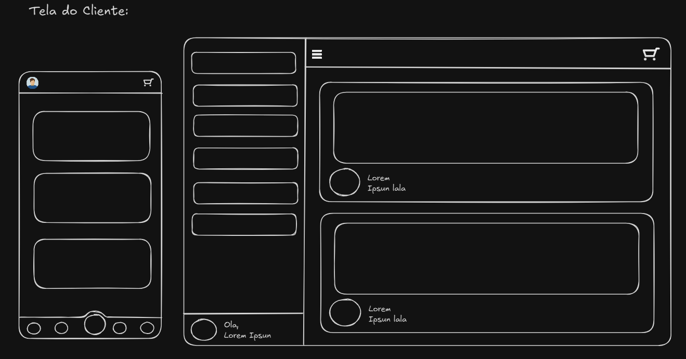
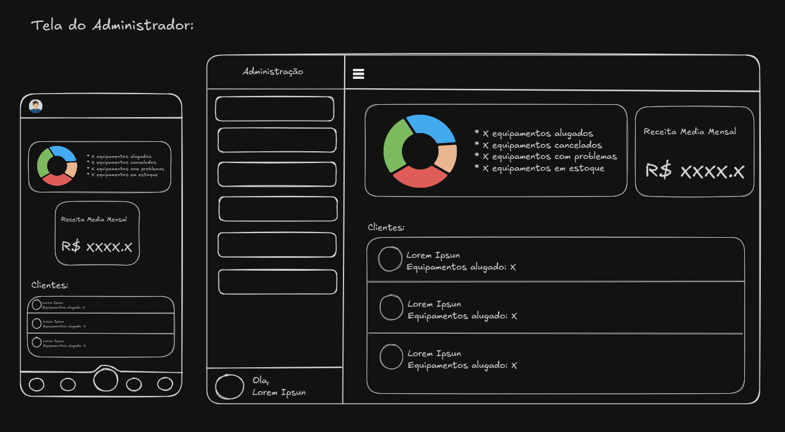
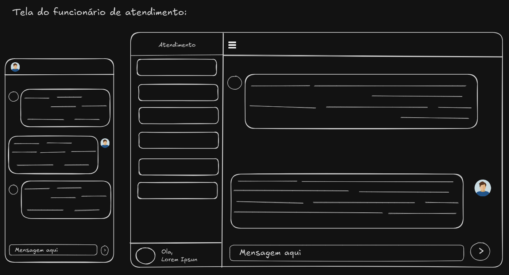

**Versão:** 1.1  
**Autores:** Carlos Silvio e Daniel Lucas  
**Data:** 08/11/2025  

---

## 📑 Sumário
1. [Introdução](#introdução)  
2. [Definições, Acrônimos e Abreviações](#definições-acrônimos-e-abreviações)  
3. [Usuários Identificados](#usuários-identificados)  
4. [Requisitos Funcionais](#requisitos-funcionais)  
5. [Requisitos Não-Funcionais](#requisitos-não-funcionais)  
   - [Disponibilidade](#disponibilidade)  
   - [Privacidade e Segurança](#privacidade-e-segurança)  
   - [Usabilidade](#usabilidade)  
   - [Suportabilidade](#suportabilidade)  
   - [Interoperabilidade](#interoperabilidade)
   - [Manutenibilidade](#manutenibilidade)  
   - [Desempenho](#desempenho)  
   - [Implementação](#implementação)  
   - [Implantação](#implantação)  
6. [Matriz de Rastreabilidade](#matriz-de-rastreabilidade)  
7. [Histórico de Alterações](#histórico-de-alterações)

---

# Introdução

O objetivo deste documento é apresentar os requisitos de software do produto **Sistema Gerenciador de Brinquedos de Festa (SGBF)**, que visa otimizar a gestão de empresas de locação de brinquedos e equipamentos para festas, oferecendo funcionalidades de controle de estoque, reservas, entregas, manutenção e relatórios.

---

## Definições, Acrônimos e Abreviações

- **SGBF** – Sistema Gerenciador de Brinquedos de Festa  
- **SaaS** – Software as a Service (Software como Serviço)  
- **RF** – Requisito Funcional  
- **RNF** – Requisito Não Funcional  
- **LGPD** – Lei Geral de Proteção de Dados 

**Identificação dos requisitos:**  
Os requisitos serão identificados no formato:  
`[RF0001]` para Requisitos Funcionais e `[RNF0001]` para Requisitos Não Funcionais.

---

# Usuários Identificados

- Usuário do sistema
  - Usuários comuns
    - Funcionário de Atendimento
    - Equipe Logística
    - Cliente Final
  - Administrador do sistema
    - Dono da empresa

- **Dono da Empresa** – Responsável pela administração do negócio, controle de finanças, estoque, reservas e relatórios.  
- **Funcionário de Atendimento** – Responsável por registrar clientes, reservas e gerar comprovantes.  
- **Equipe Logística** – Responsável por entrega e retirada dos brinquedos, além da atualização de status no sistema.  
- **Cliente Final** – Usuário externo que realiza reservas e acompanha status de pedidos.  
- **Administrador do Sistema** – Responsável técnico pelo sistema (infraestrutura, permissões e manutenção).  

---

# Requisitos Funcionais

- **[RF001]** - Como dono da empresa, quero cadastrar brinquedos e equipamentos com informações detalhadas (nome, categoria, estado de conservação, histórico de manutenção e disponibilidade).  
- **[RF002]** - Como funcionário, quero cadastrar clientes com dados pessoais e histórico de locações.  
- **[RF003]** - Como funcionário, quero registrar reservas de brinquedos e verificar disponibilidade em tempo real.  
- **[RF004]** - Como cliente, quero visualizar brinquedos disponíveis e solicitar reservas pelo site ou aplicativo.  
- **[RF005]** - Como dono, quero acompanhar todas as reservas, aprovar, alterar ou cancelar solicitações.  
- **[RF006]** - Como funcionário, quero me comunicar com clientes por meio de um chat interno no sistema para esclarecer dúvidas sobre reservas.  
- **[RF007]** - Como equipe logística, quero registrar entregas e retiradas, atualizando o status no sistema.  
- **[RF008]** - Como dono, quero registrar manutenções e limpezas, indicando técnicos responsáveis e datas.  
- **[RF009]** - Como dono, quero gerar relatórios sobre locações, brinquedos mais alugados e receitas.  
- **[RF010]** - Como cliente, quero receber notificações sobre confirmação, alteração ou cancelamento de reservas.  
- **[RF011]** - Como dono, quero visualizar um calendário com todas as locações e entregas agendadas.  
- **[RF012]** - Como administrador, quero gerenciar usuários e permissões (admin, atendente, logística, cliente).  
- **[RF013]** - Como cliente, quero consultar o status do meu pedido (aguardando, confirmado, entregue, finalizado).  
- **[RF014]** - Como dono, quero registrar e visualizar pagamentos e despesas básicas da empresa.  
- **[RF015]** - Como administrador, quero realizar backup automático do banco de dados.  
- **[RF016]** - Como dono, quero integrar o sistema ao WhatsApp para enviar orçamentos e atualizações de status.  
- **[RF017]** - Como cliente, quero receber lembretes automáticos de entrega e retirada dos brinquedos.  
- **[RF018]** - Como dono, quero que o sistema gere relatórios financeiros mensais e exporte em formato PDF ou Excel.  
- **[RF019]** - Como funcionário, quero buscar rapidamente clientes, brinquedos e reservas por nome ou código.  
- **[RF020]** - Como administrador, quero que o sistema mantenha logs de acesso e alterações.  

---

# Requisitos Não-Funcionais

## Disponibilidade
- **[RNF001]** - O sistema deve estar disponível 24h por dia, 7 dias por semana, 365 dias por ano.  
- **[RNF002]** - O sistema deve permitir acesso via navegadores (Chrome, Firefox, Edge e Safari) e dispositivos móveis.  

## Privacidade e Segurança
- **[RNF003]** - O sistema deve atender à **LGPD**, garantindo privacidade dos dados pessoais.  
- **[RNF004]** - O sistema deve utilizar metodos seguros para armezenar senhas(**bcrypt**)
- **[RNF005]** - O sistema deve suportar autenticação de dois fatores.  
- **[RNF006]** - As conexões devem utilizar conexão segura(**HTTPS**).  

## Usabilidade
- **[RNF007]** - A interface deve ser simples, intuitiva e responsiva, adequada a usuários com conhecimento básico em informática.  
- **[RNF008]** - O sistema deve suportar acessibilidade, incluindo leitura de tela e alto contraste.  

## Suportabilidade
- **[RNF009]** - O sistema deve ser compatível com os todos os navegadores.  
- **[RNF010]** - O sistema deve possuir versão mobile.  

## Interoperabilidade
- **[RNF011]** - O sistema deve permitir integração com APIs externas, como WhatsApp, gateways de pagamento e notas fiscais eletrônicas.  

## Manutenibilidade
- **[RNF012]** - O sistema deve possuir código modular e documentado, facilitando futuras atualizações.  
- **[RNF013]** - Devem ser implementados testes automatizados e logs de erro.  

## Desempenho
- **[RNF014]** - O tempo máximo de resposta para operações sincronas deve ser de **até 5 segundos**.

## Implementação
- **[RNF016]** - O sistema deve ser desenvolvido utilizando arquitetura em nuvem (SaaS).  
- **[RNF017]** - Deve utilizar banco de dados relacional (ex: PostgreSQL ou MySQL).  

## Implantação
- **[RNF018]** - O sistema deve ser hospedado em ambiente seguro com backups automáticos diários.  
- **[RNF019]** - O sistema deve permitir atualizações contínuas sem interrupção do serviço.  

---

# Telas

---

---

**Criado em Novembro de 2025 por _Carlos Silvio e Daniel Lucas_**

