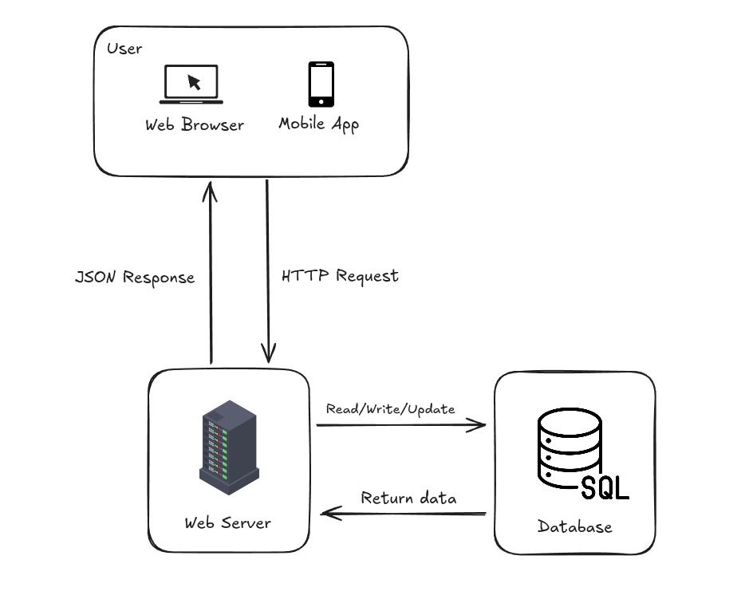

<h1>Visão do Produto</h1>
<h2>SGBF - Sistema Gerenciador de Brinquedos de Festa</h2>
<small>Versão 1.0</small>

---

## Historico de Versões

|    Data    |  Versão |          Descrição           |      Autor       |
| :--------: | :----: | :---------------------------: |  :--------------:|
| 19/10/2025 |  1.0   |     Criação do documento      | Daniel Lucas e Carlos Silvio |

# Introdução

O SGBF é uma aplicação SaaS, ou seja, um sistema hospedado em nuvem e acessado por meio da internet, sem necessidade de instalação local nas máquinas dos usuários. Seu objetivo é fornecer um ambiente único e centralizado para gerenciar reservas, estoque, logística e atendimento ao cliente, atendendo tanto aos donos das empresas de locação de brinquedos e festas quanto aos seus clientes finais. Por ser baseado em nuvem, o sistema permite acesso a partir de diferentes dispositivos e locais, garantindo mobilidade, escalabilidade e disponibilidade.

## Proposito 

O propósito deste documento é definir e descrever de forma clara os objetivos, necessidades e funcionalidades de alto nível do sistema. Ele visa apresentar as expectativas dos stakeholders e usuários, e as razões que levam essas necessidades. O documento também define os requisitos funcionais e casos de uso, detalhando como o sistema atenderá às demandas do negócio de locação de brinquedos e organização de festas.

## Deinições e Abreviações

| Termo | Definição |
| :----: | :---------: |
| SGBF | Sistema Gerenciador de Brinquedos de Festa |
| SaaS | Software as a service(Software como um serviço) |

## Escopo do Produto

O **SGBF** sistema que tem como objetivo facilitar o controle de estoque, reservas e manutenção, centralizando informações e melhorando a gestão de empresas de locação de brinquedos para festas.

---

# Posicionamento

## Oportunidade de negócios

Algumas oportunidades de negocio do **SGBF** são:

1. **Geração de dados e relatórios estratégicos**: o sistema pode oferecer relatórios personalizados sobre demanda, brinquedos mais alugados e comportamento de clientes, possibilitando o uso desses dados de forma estratégica para expansão de negócios e parcerias.

2. **Serviço de assinatura**: oferecer aos donos de empresas de locação de brinquedos e festas um modelo de assinatura mensal ou anual para utilização do sistema. Isso garante acesso contínuo à plataforma, atualizações automáticas, suporte técnico e novas funcionalidades.

## Descrição dos benefícios e dos problemas resolvidos 

| Benefício | Problema Resolvido | Afetados |
| :--------: | :----------------: | :------: | 
| Redução de erros e retrabalho | Reservas duplicadas ou perdidas, erros de agendamento | Donos, Funcionarios, Clientes
| Controle eficiente do estoque e calendario | Dificuldade de controlar o estoque e o calendario de locações | Donos, Equiepe de Logistica
| Aumento da eficiência operacional | Gestão manual ineficiente (planilhas e anotações soltas, etc) | Dono, Funcionarios
| Centralização e maior segurança das informações | Informações descentralizadas e perda de dados importantes | Dono, Funcionarios, Clientes

---

# Descrição dos stakeholders e dos usuários

Essa seção descreve os stakeholders e usuarios do **SGBF**.

## Stakeholders

Segue abaixo a lista de stakeholders.

| Stakeholder | Descrição | Papel |
| :---------: | :-------: | :---: |
| Donos das Empresas | Proprietários das empresas de locação de brinquedos e festas que contratam e utilizam o sistema | Usuário administrador do sistema |
| Funcionários de Atendimento | Profissionais que realizam reservas, cadastros de clientes e interações comerciais | Usuário do sistema |
| Equipe de Logística | Profissionais responsaveis pelas entregas e retiradas dos brinquedos | Consultar/Atualizar status de entregas e retiradas |
| Clientes Finais | Pessoas que contratam o aluguel dos brinquedos para festas |  Usuário externo, realiza reservas e acompanha status |
| Equipe de Desenvolvimento | Profissionais responsáveis por desenvolver e manter o sistema | Desenvolvedores |

## Usuarios e Atores

Segue abaixo a tabela de usuarios e atores.

| Usuário | Descrição | Responsabilidades | Stakeholders Relacionados |
| :----:  | :-------: | :---------------: | :----------: |
| Dono da Empresa | Proprietário da empresa.| Gerenciar reservas, estoque, finanças, usuários e relatórios do sistema. | Equipe de Desenvolvimento |
| Funcionário de Atendimento   | Profissional responsável por realizar reservas e atender clientes. | Cadastrar clientes, efetuar reservas, emitir comprovantes, consultar histórico de locações. | Donos das Empresas, Clientes Finais |
| Equipe Logística | Responsáveis por entrega e retirada dos brinquedos. | Acessar agenda, registrar entregas e retiradas, atualizar status no sistema. | Donos das Empresas |
| Cliente Final | Usuário externo que aluga brinquedos para festas. | Consultar disponibilidade, solicitar reservas, receber notificações e informações. | Donos das Empresas, Funcionarios de Atendimento|
| Administrador do Sistema | Responsável pela administração técnica do sistema. | Gerenciar usuários e permissões, manter o funcionamento do sistema, realizar backups e atualizações. | Equipe de Desenvolvimento |

---

# Descrição do ambiente de uso

## Ambiente de uso

1. **Ambiente do Cliente**: O **SGBF** é utilizado pelos clientes finais(organizadores de eventos/contratantes) para consultar disponibilidade, realizar reservas e acompanhar o status dos pedidos. Os clientes poderão acessar o sistema através de dispositivos móveis (smartphones e tablets) ou navegadores web em seus computadores. O navegador poderá ser Google Chrome, Mozilla Firefox ou Microsoft Edge. O aplicativo também será disponibilizado para os sistemas operacionais Android e iOS, o acesso ao ambiente requer login e senha.

2. **Ambiente Operacional/Administrativo**: Neste ambiente, **SGBF** é utilizado pelos donos das empresas, funcionários de atendimento e equipe logística. Eles utilizam o sistema para gerenciar estoque, reservas, gerenciamento de clientes, entregas e relatórios financeiros. O acesso será feito via navegador web em computadores ou dispositivos móveis, podendo também utilizar a versão mobile do sistema. Este ambiente possui níveis de acesso diferenciados, de acordo com o perfil do usuário. O acesso é feito através da internet, mediante login e senha individuais.

3. **Ambiente de Teste**: Neste ambiente, o **SGBF** é utilizado pela equipe de desenvolvimento para testar novas funcionalidades, corrigir bugs e validar melhorias antes que sejam disponibilizadas aos usuários finais. O acesso é feito via navegador web em um endereço de teste separado, com login e senha específicos para este ambiente.

## Necessidades principais quanto ao ambiente

# Tabela de Necessidades – Sistema Gerenciador de Brinquedos e Festas

A seguir, é apresentada uma tabela que descreve as necessidades dos clientes com relação à qualidade, desempenho, segurança, usabilidade e confidencialidade do sistema **SGBF**, juntamente com sua prioridade, interesse, solução atual e soluções propostas:

| Necessidade | Prioridade | Expectativa do Cliente | Situação Atual | Proposta de Solução |
|------------|------------|----------------------|----------------|-------------------|
| Qualidade / Confiabilidade | Alta | Sistema funcionando corretamente, sem erros ou falhas; dados de locações, clientes e contratos protegidos. | Testes manuais realizados pela equipe de desenvolvimento. | Implementar testes automatizados, revisão de código e validação contínua. |
| Desempenho | Alta | Sistema responde rapidamente às solicitações, mesmo com muitos usuários simultâneos. | Servidores dedicados com monitoramento de performance. | Otimizar arquitetura, consultas ao banco de dados, uso de cache e escalabilidade. |
| Escalabilidade | Alta | Sistema suporta aumento de usuários, itens de locação e dados sem comprometer performance. | Arquitetura escalável com balanceamento de carga em nuvem. | Implementar balanceamento de carga, escalabilidade automática e arquitetura em nuvem. |
| Segurança | Alta | Proteção contra acessos não autorizados, ataques e perda de informações sensíveis. | Login e senha, criptografia básica e controle de acesso. | Adotar autenticação de dois fatores, SSL/TLS, criptografia avançada e monitoramento de atividades suspeitas. |
| Usabilidade | Alta | Interface intuitiva e fácil de usar para todos os níveis de usuário, sem necessidade de treinamento complexo. | Interface simples e intuitiva. | Realizar testes de usabilidade, ajustar fluxos e elementos visuais. |
| Tempo de Resposta | Moderada | Operações de registro de locações, controle de estoque e relatórios devem ser rápidas. | Monitoramento constante do tempo de resposta. | Implementar otimizações de performance, cache e ajustes de código. |
| Confidencialidade | Alta | Informações pessoais, financeiras e contratos devem ser mantidas sigilosas. | Controles de acesso, criptografia de dados e monitoramento. | Realizar auditorias de segurança, aplicar políticas de privacidade e criptografia avançada. |

# Visão geral do produto

## Visão geral

O Sistema Gerenciador de Brinquedos e Festas é um sistema de gerenciamento de locações voltado para empresas que trabalham com foco no aluguel de brinquedos, mas também tendas, mesas, cadeiras e outros equipamentos para festas e eventos. O sistema permite que usuários registrem locações, controlem o estoque de itens, acompanhem o status de devoluções, gerem relatórios e mantenham um historico detalhado de clientes e contratos.

A comunicação entre os dispositivos e o sistema ocorre por meio de uma conexão com a internet, utilizando o protocolo HTTP/HTTPS. O servidor que o hospeda processa as solicitações dos usuários e retorna as informações, permitindo uma experiencia rápida e interativa.

O sistema pode ser acessado por meio de navegadores web e por um aplicativo android, permitindo uso em computadores, notebooks, tablets e smartphones. Além disso ele pode se integrado a outros sistemas externos, como plataformas de pagamento, sistemas de gestão financeira, ou ferramentas de emissão de notas fiscais, por meio de APIs (conjunto de regras e padrões que permite que diferentes sistemas conversem entre si e troquem informações de forma automatizada).

**Figura 1** - Arquitetura ambiental do sistema SGBF

## Custo e venda

A venda do serviço será feita através de uma assinatura que pode ser mensal ou anual. Com planos que podem cobrir as necessidades especificas de cada empresa, sendo os planos de maior valor os que oferecem mais beneficios e funcionalidades aos usuarios. 

## Licenciamento e Instalação do Produto

O **SGBF (Sistema Gerenciador de Brinquedos e Festas)** será licenciado por meio de uma licença de uso no modelo **SaaS (Software como Serviço)**, fornecida pela empresa desenvolvedora do sistema. A licença concederá ao cliente o direito de acessar e utilizar o software por meio da internet, sem a necessidade de instalação local.

O produto será oferecido como uma aplicação web hospedada em ambiente de nuvem, **dispensando a necessidade de instalação local** em computadores. Para os dispositivos móveis, será disponibilizado um acesso otimizado via navegador ou, opcionalmente, um aplicativo Android.

## Características e funcionalidades de alto nível

1. O sistema deve garantir o cadastro completo de brinquedos e equipamentos, incluindo fotos e estado de conservação, historico de manutenção e disponibilidade.

2. O sistema deve permitir o cadastro de clientes, com informações de contato, historico de locações e preferências

3. O sistema deve permitir o agendamento e controle de reservas de brinquedos, exibindo disponibilidade em tempo real.

4. O sistema deve enviar notificações automáticas aos usuários acerca das confirmações alterações, cancelamentos, ou lembretes de entrega e retirada. 

5. O sistema deve permitir o acompanhamento da manutenção e limpeza dos brinquedos, registrando datas, técnicos responsáveis e observações.

6. O sistema deve permitir o controle financeiro basico, incluindo registros de pagamentos, despesas, e relatórios de faturamento.

7. O sistema deve garantir níveis de acesso diferenciados para usuários (administrador, atendente, logística, técnico e cliente).

8. O sistema deve permitir acesso via web e dispositivos móveis com design responsivo.

9. O sistema deve ter integração com whatsapp para facilitar a atualização das informações por parte principalmente da equipe logistica. Bem como atender melhor o cliente, enviando resumos dos orçamentos e pedidos feitos.

10. O sistema deve permitir a geração de relatórios e gráficos sobre locações, receitas, brinquedos mais alugados e manutenções realizadas. 

## Restrições

Algumas restrições que se aplicam ao SGBF são:

1. Segurança de dados: O sistema deve seguir boas práticas de segurança, mas estará sujeito a limitações das APIs e serviços de terceiros (como WhatsApp API ou serviços de autenticação externos).

2. Treinamento dos usuários: Considerando que os usuários possuem conhecimentos básicos de informática, a interface deverá ser simples e intuitiva. Recursos muito avançados podem precisar ser adiados ou simplificados.

3. Manutenção e suporte técnico: O suporte e as atualizações dependerão da equipe de desenvolvimento ou de contratos futuros, o que pode limitar a evolução contínua do sistema após a entrega inicial.

4. Restrições de interoperabilidade: O sistema deve ser capaz de interoperar entre suas versões web e mobile, mantendo a sincronia e a atualização constante dos dados. 

5. Controle de permissões: O acesso, de diferentes formas, por diferentes perfis de usuário (admin, atendente, cliente, logistica, tecnicos).

6. Restrições regulatórias: Dados de pessoas físicas serão manipulados, o que ativa a LGPD (Lei Geral de Proteção de Dados).

